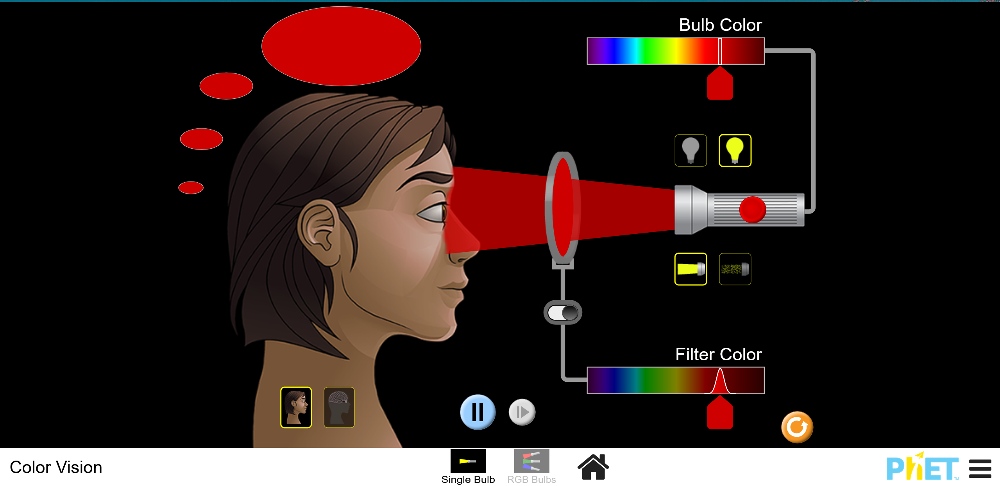
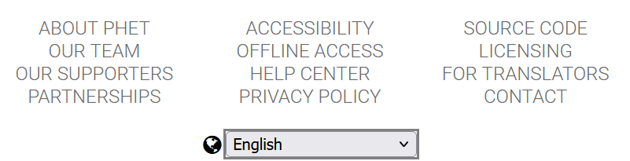

### 1. **Pendahuluan**

**Apa itu PhET Simulation?**  
PhET Simulation adalah platform edukasi yang menawarkan simulasi interaktif berbasis web untuk berbagai mata pelajaran sains dan matematika. Simulasi ini dibuat oleh University of Colorado Boulder dengan tujuan membantu pelajar memahami konsep-konsep ilmiah melalui eksperimen virtual yang interaktif. PhET memungkinkan pelajar untuk mengeksplorasi berbagai fenomena fisika, kimia, biologi, dan matematika dengan cara yang menarik dan mudah dipahami.

PhET menggabungkan metode pembelajaran aktif, yang memanfaatkan simulasi visual dan audio interaktif untuk meningkatkan pemahaman siswa. Pengguna dapat mengubah parameter pada simulasi dan melihat secara langsung bagaimana perubahan ini memengaruhi hasil, menciptakan pengalaman belajar yang mendalam.

**Sejarah Singka PhET Simulationt**  
PhET (Physics Education Technology) dimulai pada tahun 2002 oleh Carl Wieman, seorang fisikawan yang memenangkan Hadiah Nobel. Awalnya, proyek ini hanya mencakup simulasi fisika, namun kini telah berkembang mencakup banyak bidang sains lainnya. Seiring waktu, PhET telah tumbuh menjadi salah satu sumber daya pendidikan sains dan matematika yang paling populer, digunakan oleh jutaan pelajar di seluruh dunia.

Fokus awal pengembangan PhET adalah menyediakan alat yang efektif untuk pembelajaran di kelas, namun sekarang simulasi-simulasi ini juga bisa digunakan secara mandiri oleh siswa, guru, atau bahkan oleh masyarakat umum yang tertarik memahami sains dengan cara yang lebih menyenangkan dan interaktif.

### 2. **Fitur Utama PhET Simulation**

**Simulasi Interaktif**  
Salah satu daya tarik utama dari PhET Simulation adalah sifat interaktif dari simulasi-simulasinya. Setiap simulasi memungkinkan pengguna untuk berinteraksi dengan berbagai variabel atau elemen di dalamnya, memberikan pengalaman belajar yang lebih dinamis dibandingkan dengan metode pembelajaran tradisional. Dalam simulasi PhET, pengguna tidak hanya mengamati tetapi juga dapat "mengendalikan" eksperimen, seperti menambah atau mengurangi massa, mengubah suhu, mengatur kecepatan, atau memodifikasi besaran lain yang relevan dengan konsep yang sedang dipelajari.

Misalnya, dalam simulasi *Forces and Motion*, siswa dapat mengatur gaya dorong pada sebuah benda, kemudian melihat bagaimana benda itu bergerak, berhenti, atau berubah arah. Mereka juga bisa menambahkan gesekan atau hambatan udara untuk melihat bagaimana variabel-variabel ini mempengaruhi hasil. Dengan kemampuan ini, siswa tidak hanya mempelajari teori, tetapi juga mengalami sendiri bagaimana prinsip-prinsip fisika bekerja secara visual.

PhET menggunakan elemen-elemen visual dan manipulasi langsung untuk memperdalam pemahaman. Banyak simulasi dilengkapi dengan animasi yang realistis, grafik yang bisa langsung ter-update, serta suara yang menambah pengalaman imersif dalam proses belajar. Dengan fitur ini, pembelajaran sains yang umumnya dianggap abstrak bisa menjadi lebih konkret dan mudah dipahami.

**Bidang Ilmu yang Tercakup**  
PhET Simulation mencakup berbagai bidang ilmu yang luas, memungkinkan pengguna untuk mempelajari banyak disiplin ilmu dari satu platform. Beberapa bidang yang paling sering digunakan di PhET meliputi:

- **Fisika**: Ini adalah salah satu bidang yang paling banyak dicakup dalam simulasi PhET. Pengguna dapat menjelajahi konsep-konsep dasar seperti gaya, gerak, energi, listrik, magnet, hingga teori kuantum. Beberapa simulasi terkenal seperti *Pendulum Lab*, *Projectile Motion*, dan *Energy Skate Park* memungkinkan siswa memahami hukum gerak Newton, energi potensial dan kinetik, serta fenomena gravitasi dengan cara yang interaktif dan menyenangkan.
  
- **Kimia**: PhET juga menawarkan simulasi yang membantu siswa memahami reaksi kimia, bentuk molekul, dan berbagai interaksi antar partikel. Dalam simulasi *Molecule Shapes*, siswa dapat memanipulasi jumlah atom dan elektron untuk membentuk molekul dan mempelajari hubungan antara struktur molekul dengan sifat-sifat kimiawi yang dimilikinya. Di simulasi seperti *Reactants, Products and Leftovers*, siswa dapat melihat langsung bagaimana hukum konservasi massa berlaku dalam reaksi kimia.

- **Biologi**: Meski PhET lebih dikenal untuk simulasi fisika dan kimia, PhET juga memiliki simulasi di bidang biologi. Misalnya, simulasi *Natural Selection* memungkinkan pengguna untuk memahami bagaimana proses seleksi alam bekerja dalam populasi organisme, sementara simulasi *Membrane Channels* membantu siswa belajar tentang pergerakan ion melalui membran sel, yang merupakan dasar dari fisiologi sel.

- **Matematika**: Di bidang matematika, simulasi seperti *Graphing Lines* dan *Equation Grapher* membantu siswa untuk memvisualisasikan hubungan antara persamaan matematika dan grafiknya. Ini sangat bermanfaat bagi siswa yang mungkin kesulitan menghubungkan ekspresi aljabar dengan representasi visualnya di bidang koordinat.

Dengan cakupan topik yang begitu luas, PhET dapat digunakan di berbagai tingkatan pendidikan, mulai dari sekolah dasar hingga perguruan tinggi, dan mencakup berbagai konsep yang kompleks namun disederhanakan melalui visualisasi interaktif.

**Penggunaan Multiplatform**  
PhET Simulation dirancang agar mudah diakses oleh siapa saja, di mana saja, dan kapan saja. Pengguna dapat mengakses simulasi melalui peramban web tanpa perlu mengunduh perangkat lunak tambahan. Ini memungkinkan siswa, guru, dan pelajar mandiri untuk mengakses simulasi dengan cepat hanya dengan koneksi internet. Tampilan antarmuka yang sederhana dan ramah pengguna membuat siapa pun dapat memulai simulasi hanya dalam beberapa klik.

Untuk situasi di mana akses internet mungkin terbatas atau tidak tersedia, PhET juga menyediakan opsi pengunduhan simulasi untuk digunakan secara offline. Ini memungkinkan simulasi diakses di daerah-daerah yang mungkin memiliki keterbatasan teknologi atau infrastruktur internet yang belum memadai. Selain itu, aplikasi PhET juga tersedia untuk perangkat Android dan iOS, memungkinkan pengguna untuk mengakses simulasi di perangkat seluler mereka, sehingga pembelajaran bisa lebih fleksibel dan tidak terbatas pada kelas atau laboratorium komputer.

PhET mendukung berbagai sistem operasi, termasuk Windows, Mac, dan Linux. Ketersediaan ini menjadikannya alat yang sangat fleksibel dan inklusif bagi pengguna dari berbagai latar belakang teknologi.

**Tampilan Visual yang Menarik dan Ramah Pengguna**  
Antarmuka PhET dirancang dengan sangat baik untuk memudahkan penggunaan, bahkan bagi pengguna yang tidak terlalu familiar dengan teknologi. Simulasi dilengkapi dengan ikon-ikon yang jelas, petunjuk-petunjuk singkat, serta kontrol yang intuitif, sehingga pengguna bisa langsung memahami cara mengoperasikan simulasi. Visual yang digunakan sangat mendukung proses pembelajaran dengan grafik yang jelas, animasi yang realistis, dan penggunaan warna yang tepat untuk menyoroti aspek-aspek penting dari simulasi.

PhET juga menyediakan panduan pengajaran bagi guru, termasuk langkah-langkah cara mengintegrasikan simulasi ke dalam materi pelajaran. Guru dapat menggunakan simulasi PhET sebagai alat bantu visual untuk menjelaskan konsep-konsep yang mungkin sulit dipahami hanya dengan penjelasan verbal atau menggunakan buku teks.

Dengan semua fitur di atas, PhET Simulation tidak hanya menjadi alat pembelajaran yang interaktif dan efektif, tetapi juga membantu mendemokratisasi pendidikan sains dan matematika dengan akses yang luas dan kemudahan penggunaan.

 

### 3. **Manfaat Menggunakan PhET dalam Pembelajaran**

Penggunaan PhET Simulation dalam pembelajaran membawa berbagai manfaat yang signifikan, baik untuk guru maupun siswa. Berikut adalah penjelasan lebih mendalam mengenai manfaat yang bisa didapatkan dari penggunaan PhET dalam proses pembelajaran:

**Pembelajaran Aktif**  
Salah satu tujuan utama dalam pendidikan modern adalah menciptakan pembelajaran aktif, di mana siswa bukan hanya penerima informasi pasif tetapi juga berperan aktif dalam proses belajar. PhET Simulation mendukung pendekatan ini dengan memungkinkan siswa untuk melakukan eksplorasi mandiri melalui simulasi interaktif. Misalnya, dalam simulasi *Energy Skate Park*, siswa dapat mengubah parameter seperti tinggi awal pemain skateboard, massa, dan gaya gesekan untuk memahami prinsip energi kinetik dan energi potensial. Dengan bermain-main dan mengeksplorasi berbagai kemungkinan, siswa tidak hanya belajar teori, tetapi juga mengembangkan intuisi ilmiah yang mendalam.

Pendekatan ini sangat membantu karena siswa diberi kesempatan untuk belajar dengan mencoba dan melihat langsung hasil dari tindakan yang mereka lakukan. Hal ini mendorong rasa ingin tahu dan kreativitas, karena siswa dapat bereksperimen tanpa batasan atau risiko, berbeda dengan eksperimen fisik di laboratorium yang sering kali dibatasi oleh peralatan, waktu, dan keamanan. Pembelajaran aktif melalui PhET juga memungkinkan siswa untuk membangun pemahaman secara bertahap, dimulai dari konsep yang lebih sederhana hingga yang lebih kompleks, sesuai dengan tempo pembelajaran mereka masing-masing.

**Mempermudah Pemahaman Konsep Kompleks**  
Konsep-konsep dalam sains dan matematika sering kali abstrak dan sulit dipahami hanya dengan teks atau penjelasan verbal. Contohnya, hukum gerak Newton atau sifat gelombang elektromagnetik mungkin terdengar rumit jika hanya dijelaskan secara teoretis. Namun, dengan bantuan visualisasi yang interaktif, PhET mampu menyederhanakan konsep-konsep ini dan membuatnya lebih mudah dipahami.

Misalnya, dalam simulasi *Projectile Motion*, siswa dapat melihat bagaimana sudut peluncuran, kecepatan awal, dan gravitasi mempengaruhi lintasan proyektil. Siswa dapat langsung mengubah parameter dan melihat perubahan lintasan secara visual, sehingga mereka dapat mengembangkan pemahaman yang lebih intuitif tentang hukum gerak parabola. Dalam kasus hukum termodinamika, simulasi seperti *Gas Properties* memungkinkan siswa untuk memanipulasi tekanan, volume, dan suhu gas dalam tabung untuk mempelajari hubungan antara variabel-variabel ini dalam konteks Hukum Boyle dan Hukum Charles.

Simulasi ini tidak hanya membuat pelajaran lebih mudah dimengerti, tetapi juga memberikan kesempatan kepada siswa untuk memverifikasi hipotesis dan pemahaman mereka secara langsung. Dengan melakukan percobaan virtual yang interaktif, siswa bisa melihat secara real-time bagaimana perubahan kecil dalam satu variabel bisa mempengaruhi keseluruhan sistem, yang sering kali sulit divisualisasikan melalui buku teks saja.

**Dukungan untuk Guru dan Pelajar**  
PhET tidak hanya bermanfaat bagi siswa, tetapi juga merupakan alat yang sangat berharga bagi para guru. Guru dapat menggunakan simulasi PhET sebagai alat bantu pengajaran untuk menjelaskan konsep-konsep yang sulit dipahami hanya dengan penjelasan verbal atau ilustrasi statis di papan tulis. Simulasi interaktif memungkinkan guru untuk memvisualisasikan ide-ide abstrak secara dinamis dan mengajak siswa untuk terlibat dalam diskusi yang lebih mendalam.

PhET juga menyediakan berbagai sumber daya tambahan yang dapat digunakan oleh guru. Beberapa di antaranya termasuk:
- **Panduan Pengajaran**: Banyak simulasi di PhET yang disertai dengan panduan pengajaran yang dirancang khusus untuk membantu guru merancang pelajaran menggunakan simulasi tersebut. Panduan ini sering kali mencakup tujuan pembelajaran, langkah-langkah praktis untuk mengintegrasikan simulasi ke dalam kelas, dan pertanyaan diskusi yang dapat diajukan kepada siswa untuk merangsang pemikiran kritis.
- **Lembar Kerja dan Tugas**: PhET menyediakan lembar kerja dan tugas yang dapat diunduh dan digunakan oleh guru untuk mendampingi simulasi. Lembar kerja ini dirancang untuk membantu siswa dalam memahami dan mempraktikkan konsep-konsep yang dipelajari melalui simulasi, dengan instruksi yang jelas dan pertanyaan yang merangsang.
- **Materi Latihan dan Kuis**: Guru juga dapat menggunakan simulasi PhET sebagai dasar untuk latihan dan kuis di kelas. Simulasi ini memungkinkan guru untuk merancang pertanyaan berbasis eksperimen yang mengharuskan siswa untuk memahami tidak hanya konsep dasar tetapi juga aplikasinya dalam situasi dunia nyata.

### 4. **Cara Menggunakan PhET**

Menggunakan PhET Simulation sangatlah mudah, baik untuk siswa, guru, maupun pengguna umum. PhET dirancang agar dapat diakses dengan cepat dan sederhana, tanpa memerlukan keterampilan teknologi khusus. Di bagian ini, akan dijelaskan beberapa langkah praktis untuk memulai dan memaksimalkan penggunaan PhET dalam pembelajaran.

#### **Akses Melalui Website**
PhET dapat diakses secara gratis melalui situs web resminya di [https://phet.colorado.edu](https://phet.colorado.edu). Situs ini merupakan pintu utama bagi siapa saja yang ingin menggunakan simulasi interaktif PhET. Berikut langkah-langkah umum yang dapat diikuti untuk mulai menggunakan simulasi:

1. **Kunjungi situs web PhET**. Dari halaman utama, pengguna akan melihat berbagai pilihan kategori simulasi yang tersedia, seperti fisika, kimia, matematika, dan biologi.
   
2. **Cari simulasi yang diinginkan**. PhET menyediakan fitur pencarian yang memudahkan pengguna untuk menemukan simulasi yang sesuai dengan kebutuhan mereka. Pengguna dapat mencari simulasi berdasarkan topik (misalnya "Hukum Newton" atau "Reaksi Kimia"), atau menggunakan filter untuk menyaring simulasi berdasarkan subjek atau tingkat pendidikan.

3. **Mulai simulasi**. Setelah menemukan simulasi yang diinginkan, pengguna cukup mengklik ikon simulasi tersebut. Sebagian besar simulasi dapat langsung dijalankan melalui browser tanpa perlu mengunduh perangkat lunak tambahan. PhET telah dioptimalkan untuk bekerja dengan baik di berbagai platform, sehingga pengguna dapat mengakses simulasi di komputer desktop, laptop, tablet, atau bahkan ponsel pintar.
   
4. **Berinteraksi dengan simulasi**. Setelah simulasi terbuka, pengguna bisa langsung mulai bereksperimen dengan mengubah parameter atau memainkan kontrol yang tersedia. Simulasi PhET memiliki antarmuka yang intuitif dan mudah digunakan, sehingga siswa maupun guru bisa dengan cepat memahami cara kerja simulasi tersebut.

PhET menawarkan berbagai simulasi yang dirancang dengan kualitas visual yang menarik dan mudah dipahami, yang memungkinkan siswa untuk berinteraksi langsung dengan konsep-konsep ilmiah. Pengguna dapat bereksperimen dengan variabel-variabel dalam simulasi untuk melihat dampaknya secara real-time, yang membuat pembelajaran menjadi lebih dinamis dan menyenangkan.

#### **Penggunaan Offline**
Untuk situasi di mana akses internet mungkin terbatas, PhET menyediakan opsi pengunduhan simulasi untuk penggunaan offline. Ini sangat berguna di daerah-daerah yang memiliki keterbatasan konektivitas internet atau untuk penggunaan di tempat yang tidak memiliki akses internet, seperti di laboratorium atau kelas luar jaringan. Berikut adalah cara menggunakan PhET secara offline:

1. **Unduh simulasi yang diinginkan**. Di halaman simulasi yang ingin digunakan, terdapat opsi untuk mengunduh file simulasi. File ini bisa diunduh ke komputer dan dijalankan tanpa koneksi internet.
   
2. **Instal aplikasi PhET untuk akses offline**. Pengguna juga dapat menginstal aplikasi PhET, yang memungkinkan mereka untuk menyimpan dan menjalankan berbagai simulasi secara offline. Aplikasi ini tersedia untuk perangkat Windows, macOS, dan Linux, serta untuk perangkat mobile seperti Android dan iOS.
   
3. **Simpan dan distribusikan**. Setelah diunduh, simulasi tersebut bisa disimpan di komputer atau dibagikan melalui perangkat USB, email, atau media penyimpanan lainnya kepada siswa atau rekan guru. Ini mempermudah penggunaan PhET dalam lingkungan yang mungkin tidak memiliki infrastruktur teknologi yang memadai.

Dengan adanya opsi offline ini, PhET memberikan fleksibilitas yang lebih besar bagi guru dan siswa untuk tetap dapat mengakses sumber daya pembelajaran berkualitas tinggi kapan saja dan di mana saja.

#### **Penyesuaian Bahasa**
PhET mendukung lebih dari 100 bahasa, termasuk Bahasa Indonesia. Ini memungkinkan PhET untuk digunakan secara luas di berbagai negara dan konteks pendidikan, serta memudahkan pengguna yang mungkin kurang nyaman dengan bahasa Inggris. Berikut cara mengganti bahasa di PhET:

1. **Pilih bahasa dari halaman utama**. Di bagian atas situs web PhET, terdapat menu drop-down yang memungkinkan pengguna untuk mengganti bahasa antarmuka sesuai dengan preferensi mereka. Cukup pilih bahasa yang diinginkan, dan seluruh konten situs akan diterjemahkan secara otomatis.

2. **Bahasa dalam simulasi**. Beberapa simulasi juga tersedia dalam berbagai bahasa. Saat memulai simulasi, pengguna dapat memilih bahasa yang ingin digunakan dalam simulasi tersebut, jika tersedia. Ini sangat berguna bagi siswa yang mungkin belum menguasai bahasa Inggris secara mendalam, sehingga mereka tetap dapat belajar menggunakan bahasa ibu mereka.

Dengan adanya dukungan multibahasa ini, PhET menjangkau lebih banyak pengguna di seluruh dunia, sehingga pendidikan sains dan matematika yang interaktif bisa diakses secara global, tanpa adanya hambatan bahasa.

#### **Menggunakan PhET dalam Pengajaran**
Bagi guru, PhET merupakan alat pengajaran yang sangat fleksibel dan dapat diintegrasikan ke dalam berbagai metode pengajaran, mulai dari kelas tatap muka hingga pembelajaran daring. Beberapa cara penggunaan PhET dalam pengajaran meliputi:

1. **Simulasi sebagai alat bantu visual di kelas**: Guru dapat menggunakan PhET di kelas sebagai alat bantu pengajaran untuk menjelaskan konsep-konsep sulit. Simulasi dapat diproyeksikan di layar dan digunakan untuk mendemonstrasikan eksperimen yang mungkin sulit dilakukan di dunia nyata karena keterbatasan waktu, biaya, atau keamanan. Misalnya, dalam pelajaran tentang rangkaian listrik, guru bisa menggunakan simulasi *Circuit Construction Kit* untuk mendemonstrasikan cara merangkai resistor dan kapasitor dalam rangkaian, serta melihat langsung dampaknya pada arus dan tegangan.

2. **Tugas berbasis simulasi**: Guru dapat memberikan tugas yang berbasis pada simulasi. Siswa dapat diminta untuk menjalankan simulasi tertentu, mengubah variabel-variabelnya, dan mencatat hasil yang didapat. Misalnya, dalam pelajaran fisika, siswa bisa diminta untuk menjalankan simulasi *Projectile Motion* dan mencatat bagaimana perubahan sudut peluncuran memengaruhi jarak tempuh proyektil.

3. **Lembar kerja interaktif**: PhET juga menyediakan lembar kerja yang dapat diunduh dan disesuaikan oleh guru untuk digunakan bersama dengan simulasi. Lembar kerja ini sering kali berisi instruksi terperinci tentang bagaimana menjalankan simulasi dan mencatat hasilnya, serta pertanyaan diskusi yang mendorong siswa untuk berpikir kritis tentang hasil yang mereka peroleh.

4. **Pembelajaran jarak jauh**: PhET juga sangat efektif dalam pembelajaran jarak jauh. Guru dapat memberikan link simulasi kepada siswa yang belajar dari rumah dan membimbing mereka melalui simulasi dengan instruksi atau video konferensi. Dengan kemudahan akses PhET secara online, pembelajaran interaktif bisa terus berlangsung meskipun siswa dan guru berada di tempat yang berbeda.

#### **PhET di Perangkat Mobile**
PhET juga dapat diakses di perangkat mobile seperti tablet dan smartphone, baik melalui browser atau aplikasi PhET yang tersedia di Google Play Store dan App Store. Berikut langkah-langkah menggunakan PhET di perangkat mobile:

1. **Unduh aplikasi PhET di Play Store atau App Store**. Aplikasi ini memungkinkan pengguna untuk mengakses berbagai simulasi secara langsung di perangkat seluler mereka.
   
2. **Akses PhET melalui browser mobile**. Jika tidak ingin mengunduh aplikasi, pengguna juga dapat langsung mengakses situs web PhET melalui browser di perangkat mobile. Situs ini dioptimalkan agar responsif dan tetap mudah digunakan di layar yang lebih kecil.

Penggunaan di perangkat mobile memberikan fleksibilitas tambahan bagi siswa untuk belajar di mana saja, bahkan di luar kelas atau di rumah. Ini juga memungkinkan siswa untuk mengulang-ulang simulasi dengan mudah, kapan pun mereka butuhkan.

Dengan kemudahan akses dan berbagai pilihan penggunaan, PhET Simulation memberikan solusi pembelajaran yang komprehensif dan fleksibel untuk berbagai skenario pendidikan, baik di dalam kelas, di rumah, maupun secara daring.

### 5.  **PhET untuk Berbagai Tingkat Pendidikan**

Tingkat SD, SMP, dan SMA
PhET memiliki simulasi yang cocok untuk berbagai tingkat pendidikan. Untuk siswa SD, simulasi yang lebih sederhana dan visual lebih cocok, seperti Balloons and Static Electricity untuk mempelajari muatan listrik. Di tingkat SMP, siswa bisa menggunakan simulasi seperti Forces and Motion untuk memahami gaya dan gerak. Sementara di SMA, simulasi yang lebih kompleks seperti Energy Skate Park digunakan untuk mempelajari hukum kekekalan energi.

Perguruan Tinggi
Di tingkat perguruan tinggi, PhET juga bisa digunakan, misalnya simulasi Quantum Tunneling and Wave Packets untuk mempelajari konsep-konsep fisika kuantum yang sulit dipahami tanpa visualisasi.

### 6. **Kelebihan dan Kekurangan Menggunakan PhET dalam Pembelajaran**

PhET Simulation memiliki berbagai kelebihan yang membuatnya sangat populer di kalangan guru dan siswa. Namun, seperti semua alat pembelajaran, PhET juga memiliki beberapa keterbatasan yang perlu diperhatikan. Berikut adalah pembahasan mengenai kelebihan dan kekurangan PhET dalam konteks pembelajaran.

#### **Kelebihan PhET dalam Pembelajaran**

1. **Interaktif dan Menarik**  
PhET dirancang untuk membuat pembelajaran lebih interaktif dan menyenangkan. Simulasi interaktif memungkinkan siswa untuk secara langsung memanipulasi variabel-variabel dalam eksperimen virtual. Ini memberikan pengalaman belajar yang lebih dinamis dibandingkan metode pembelajaran tradisional seperti ceramah atau buku teks. Misalnya, dalam simulasi *Gravity and Orbits*, siswa dapat mengubah massa dan jarak planet untuk melihat bagaimana gaya gravitasi bekerja, yang membuat mereka lebih terlibat dalam proses pembelajaran.

2. **Membantu Memvisualisasikan Konsep Abstrak**  
PhET sangat efektif dalam membantu siswa memahami konsep-konsep yang abstrak atau sulit divisualisasikan, seperti hukum gerak, listrik, atau mekanika kuantum. Dengan simulasi yang interaktif, konsep-konsep ini dapat divisualisasikan dengan jelas, sehingga siswa dapat melihat hubungan sebab-akibat dari perubahan variabel. Ini sangat penting untuk konsep yang sulit dijelaskan secara lisan atau melalui gambar statis di buku.

3. **Akses Mudah dan Gratis**  
PhET tersedia secara gratis untuk semua orang, dan bisa diakses melalui berbagai perangkat, termasuk komputer, tablet, dan smartphone. Hal ini memberikan aksesibilitas yang luas bagi siswa dan guru, tanpa memerlukan investasi dalam perangkat lunak khusus atau peralatan mahal. Selain itu, PhET tidak memerlukan keahlian teknis yang tinggi, sehingga dapat digunakan oleh semua tingkat pengguna.

4. **Dukungan Multibahasa**  
PhET mendukung lebih dari 100 bahasa, termasuk Bahasa Indonesia, yang membuatnya dapat digunakan secara luas di berbagai negara. Ini memungkinkan siswa dari berbagai latar belakang bahasa untuk mengakses dan memahami simulasi dengan lebih mudah. Bahasa lokal sangat membantu siswa yang mungkin kesulitan memahami instruksi atau penjelasan dalam bahasa asing, sehingga mereka bisa fokus pada pembelajaran konsep.

5. **Fleksibel untuk Pembelajaran Mandiri dan Kolaboratif**  
PhET bisa digunakan baik dalam konteks pembelajaran mandiri maupun kolaboratif. Siswa dapat menjelajahi simulasi sendiri di rumah untuk memperkuat pemahaman mereka, atau bekerja dalam kelompok di kelas untuk melakukan percobaan virtual bersama-sama. Kemampuan ini membuat PhET sangat fleksibel dan dapat disesuaikan dengan berbagai metode pengajaran.

6. **Tersedia untuk Penggunaan Online dan Offline**  
PhET tidak hanya dapat diakses secara online, tetapi juga memiliki opsi untuk diunduh dan digunakan secara offline. Ini sangat membantu di daerah-daerah yang memiliki keterbatasan akses internet atau untuk situasi di mana siswa perlu menggunakan simulasi tanpa koneksi internet. Dengan begitu, pembelajaran interaktif bisa terus berlangsung bahkan tanpa konektivitas.

#### **Kekurangan PhET dalam Pembelajaran**

1. **Tidak Menggantikan Pengalaman Praktikum Fisik**  
Meskipun PhET sangat berguna untuk membantu siswa memahami konsep-konsep ilmiah melalui simulasi virtual, pengalaman ini tidak sepenuhnya menggantikan pentingnya eksperimen fisik di laboratorium. Beberapa keterampilan praktis, seperti kemampuan mengoperasikan peralatan laboratorium atau mengamati hasil percobaan nyata, tidak bisa diajarkan melalui simulasi. Oleh karena itu, PhET lebih cocok digunakan sebagai pelengkap pembelajaran, bukan pengganti total.

2. **Keterbatasan pada Topik Tertentu**  
Walaupun PhET mencakup berbagai topik di bidang sains dan matematika, beberapa topik atau konsep mungkin tidak memiliki simulasi yang tersedia. Guru yang mengajarkan materi-materi yang lebih spesifik atau di luar jangkauan PhET mungkin perlu mencari alat tambahan atau menggunakan metode lain untuk menjelaskan konsep tersebut.

3. **Ketergantungan pada Akses Teknologi**  
Meskipun PhET bisa diakses secara gratis dan di berbagai perangkat, tetap ada tantangan dalam hal ketergantungan pada teknologi. Tidak semua siswa memiliki akses ke perangkat yang memadai atau koneksi internet yang stabil, terutama di daerah-daerah terpencil atau dengan infrastruktur yang terbatas. Hal ini bisa menjadi hambatan dalam penggunaan PhET secara luas, terutama dalam pembelajaran jarak jauh atau daring.

4. **Kurangnya Keterlibatan Sensorik Lainnya**  
Simulasi PhET hanya melibatkan penglihatan dan, dalam beberapa kasus, pendengaran. Ini berarti siswa tidak bisa mengalami sentuhan atau merasakan hasil fisik dari percobaan. Dalam eksperimen nyata, siswa sering kali belajar dari manipulasi langsung alat dan bahan, sesuatu yang tidak bisa didapatkan hanya melalui simulasi layar. Pengalaman belajar yang lebih kaya secara sensorik biasanya lebih efektif dalam membantu siswa memahami dan mengingat konsep yang dipelajari.

5. **Tidak Semua Siswa Nyaman dengan Teknologi**  
Walaupun PhET relatif mudah digunakan, tidak semua siswa merasa nyaman menggunakan teknologi, terutama mereka yang belum terbiasa dengan penggunaan perangkat digital dalam pembelajaran. Beberapa siswa mungkin mengalami kesulitan dalam mengoperasikan simulasi, terutama jika perangkat mereka lambat atau mereka kurang memahami cara kerja alat digital.

Berikut adalah poin nomor 7 yang membahas kesimpulan:

### 7. **Kesimpulan**

PhET Simulation merupakan platform edukasi yang interaktif dan mudah diakses yang sangat membantu dalam pembelajaran sains dan matematika. Dibuat oleh University of Colorado Boulder, PhET menawarkan simulasi-simulasi yang memungkinkan siswa untuk mengeksplorasi berbagai konsep ilmiah dengan cara yang lebih visual dan langsung, menjadikannya alat pembelajaran yang menarik dan efektif. Beberapa keunggulan utama PhET adalah kemampuannya untuk mempermudah pemahaman konsep-konsep kompleks melalui visualisasi interaktif, dukungan pembelajaran aktif, fleksibilitas multiplatform, dan dukungan multibahasa.

Namun, PhET tidak sepenuhnya menggantikan praktikum fisik yang membutuhkan pengalaman langsung dengan alat laboratorium dan masih bergantung pada akses teknologi. Meski begitu, dengan kemampuannya yang luas dan fleksibilitasnya, PhET tetap menjadi alat yang penting untuk memperkuat pemahaman siswa dalam pelajaran sains dan matematika di berbagai tingkatan pendidikan.